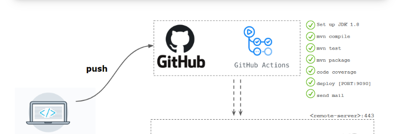

# Career Services Application

## 1. Description
The objective of this project is to provide a career services platform where the students (people looking for jobs) will be able to post and update their portfolio and the employers should be able to post jobs. With the help of this, you can carry out a job head hunting in your own comfort. This benefits job-seeking candidates and employers to shortlist their potential job and employee respectively. This can also help employers find specific candidates as per their requirements along with job seekers being able to tailor their profile as per the market. All you require is a PC or a mobile device with the Internet to access the website online. To get to this online career services system all the Students and Employers will create an account and use their email and password to log in. Students will create/modify their profiles and will view and apply to job postings. Employers will create and manage their job posts, and review applications from candidates. The login credentials for this system are under high security and nobody will have the capacity to crack it easily. Employers will receive notifications when students apply to their job offers, and students when they are called for an interview.

The following are the categories of main users:
1. Employer – create an account/register, login, browse candidates, add job offers, select candidates that have already applied to an offer for an interview, track the post
2. Student/Candidate – create an account/register, login, and build/upload a resume; browse and apply for job offers; track applications
3. Admin – Managing all user profiles, postings and tracking

## 2. Team Members
1. Manan Paruthi (MannParutthi) - 40192620
     Role - Frontend Developer
     Strengths - Angular
2. Ashwin Raghunath (ashraghunath) - 40192120
     Role - Architect and Backend Developer
     Strengths - Sprint Boot, Security and Cloud
3. Nipun Hedaoo (nipunh) - 40165942
     Role - Frontend Developer
     Strengths - Angular
4. Jwalit Shah (jwalit21) - 40227541
     Role - Backend Stack Developer
     Strengths - Sprintboot
6. Dinesh Kini (dinesh-07) - 40231799
     Role - Automation and QA
     Strengths - MongoDB, JUnit, Github action CI/CD
8. Anagha Harinath - 40224578
     Role - Scrum Master
     Strengths - Angular

## 3. Project Approach & Technology
* Frontend - Angular  
We chose Angular for its ability to simplify the development process while providing high-performing and dynamic
web applications. Its intuitive and straightforward design makes it a great choice for our project. This versatility
allows us to deliver an engaging and user-friendly experience.

* Backend - Springboot  
Spring Boot is a great fit due to its ability to expedite development within a short timeframe. It simplifies setup and configuration, allowing us to focus on building core features. Additionally, Spring Boot's security features provide a solid foundation for protecting user data. 

* Database - MongoDB  
By using MongoDB, we will benefit from its flexible data model, which allows
us to store and manage data in a way that makes sense for our specific use case. MongoDB also provides ease
of use, with a simple and intuitive interface that makes it easy to interact with the data. Additionally, MongoDB's 
compatibility with Spring Boot, allows for seamless integration with our application, improving overall efficiency
and performance.

* Documentation - GitHub Wiki  
We will use Github Wiki since it is easily accessible and conveniently located within your project repository hence allowing for seamless navigation and quick access to project documentation. 

### System architecture

### Github Action CI/CD

